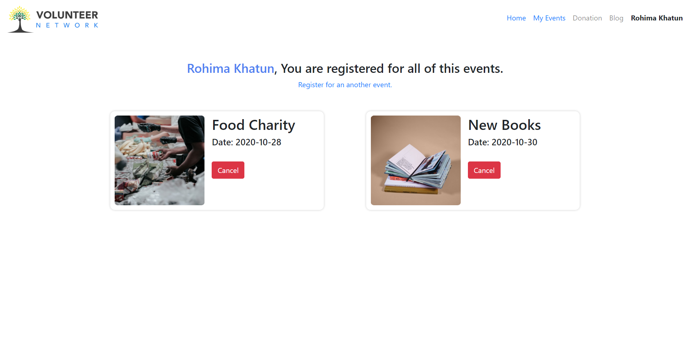
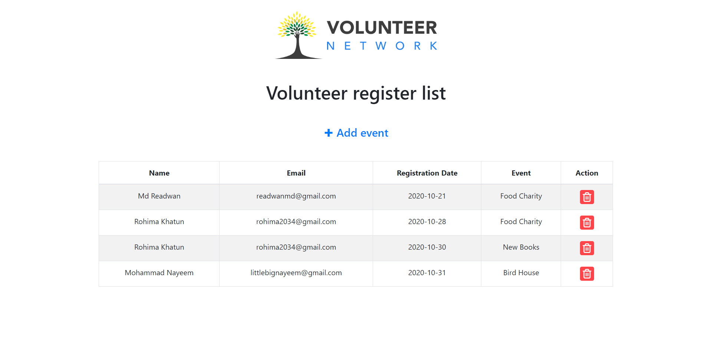

# Volunteer Network - A fullstack voluntary service provider SPA [`LIVE`](https://volunteer-network-20.web.app/)

 

## Features
Volunteer Network is a fullstack voluntary service provider single page application. It’s developed by using React, React-Router, Html, CSS, reactBootstrap, MaterialUI and Firebase.

#### User 
- User can register as a volunteer.
- User can check all of his/her registered event list in users dashboard.
- user can cancel his/her registered event.

#### Admin
- Admin can add or remove events.
- An admin can add more admins.
- Admin will be able to manage the registered user events.
- Admin will be able to see all of the users registered events.

 

### [`BACKEND REPOSITORY`](https://github.com/readwanmd/volunteerNetwork-server)

   

